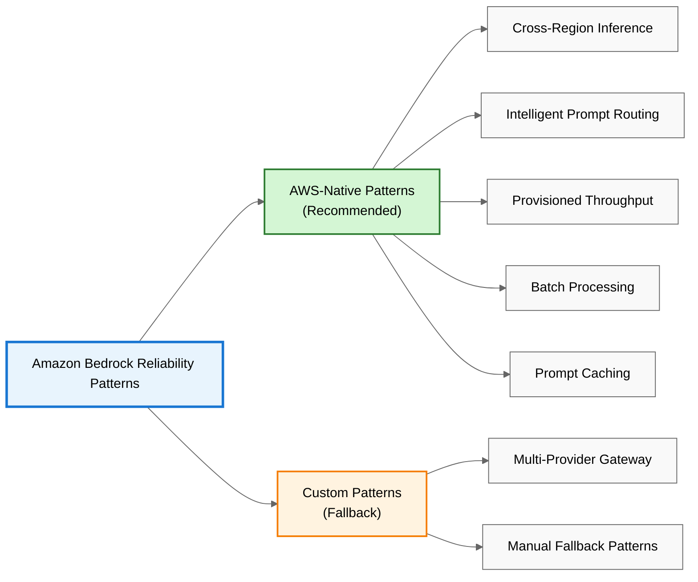
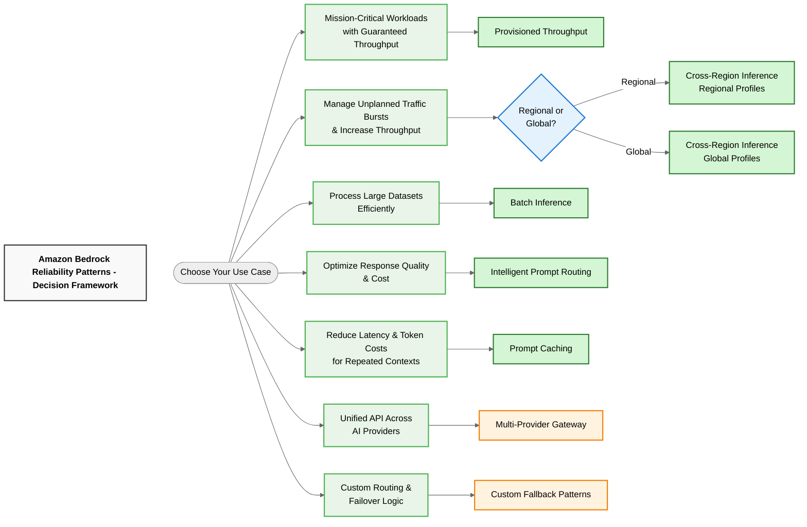

# Amazon Bedrock Reliability Patterns

Amazon Bedrock is a fully managed service that offers high-performing foundation models from leading AI companies through a single API. Customers are using Amazon Bedrock to build innovative applications that transform their businesses, bringing efficiency, intelligence, and automation to their workflows.

## Overview

As enterprises build mission-critical AI applications with Bedrock, implementing robust reliability patterns ensures optimal performance and seamless scalability. This repository showcases architectural patterns that leverage AWS's global infrastructure and multi-model capabilities to create resilient, highly available AI applications.

These patterns demonstrate how to harness the full power of Bedrock through strategic use of AWS-native features and complementary approaches - from intelligent cross-region routing to advanced caching strategies. Whether you're building global AI applications or optimizing for cost efficiency, these patterns provide architectures to enhance your Bedrock implementation.



> **AWS-Native First**: Start with AWS-managed solutions that handle complexity automatically. Use custom patterns only when AWS-native features don't meet your specific requirements.

## AWS-Native Capacity Solutions

Use these AWS-managed patterns first. AWS handles routing, failover, and optimization automatically.

### **Cross-Region Inference**
- **Benefit**: [Increased throughput capacity](https://docs.aws.amazon.com/bedrock/latest/userguide/cross-region-inference.html) across AWS Regions
- **How**: AWS automatically selects optimal regions within geography (US, EU, APAC) or worldwide (Global profiles)
- **Use case**: Unplanned traffic bursts, global applications, maximum capacity needs
- **Code Example**: [patterns/aws_native/01_cross_region_inference.py](patterns/aws_native/01_cross_region_inference.py)
- **Architecture**: [View Diagram](docs/diagram-generators/pattern1_cross_region_inference_diagram.md)

### **Intelligent Prompt Routing**
- **Benefit**: [Automatic model selection](https://aws.amazon.com/bedrock/intelligent-prompt-routing/) based on prompt complexity
- **How**: AWS routes requests to optimal model within same family for quality and cost
- **Use case**: Variable prompt complexity, cost optimization
- **Code Example**: [patterns/aws_native/02_intelligent_prompt_routing.py](patterns/aws_native/02_intelligent_prompt_routing.py)
- **Architecture**: [View Diagram](docs/diagram-generators/pattern2_intelligent_prompt_routing_diagram.md)

### **Provisioned Throughput**
- **Benefit**: [Reserved capacity with guaranteed performance](https://docs.aws.amazon.com/bedrock/latest/userguide/prov-throughput.html)
- **How**: Purchase dedicated model units with commitment terms
- **Use case**: Predictable workloads, consistent performance requirements
- **Code Example**: [patterns/aws_native/03_provisioned_throughput.py](patterns/aws_native/03_provisioned_throughput.py)
- **Architecture**: [View Diagram](docs/diagram-generators/pattern3_provisioned_throughput_diagram.md)

### **Batch Processing**
- **Benefit**: [Cost-effective bulk processing](https://docs.aws.amazon.com/bedrock/latest/userguide/batch-inference.html) for large datasets
- **How**: Asynchronous processing of multiple prompts via S3
- **Use case**: Large datasets, data pipelines, cost-sensitive workloads
- **Code Example**: [patterns/aws_native/04_batch_processing.py](patterns/aws_native/04_batch_processing.py)
- **Architecture**: [View Diagram](docs/diagram-generators/pattern4_batch_inference_diagram.md)

### **Prompt Caching**
- **Benefit**: [Reduced latency and token costs](https://docs.aws.amazon.com/bedrock/latest/userguide/prompt-caching.html) for repeated contexts
- **How**: Cache prompt prefixes with 5-minute TTL using Nova models
- **Use case**: Repeated contexts, document-based chatbots, Q&A applications
- **Demo**: Uses AWS CAF for AI PDF for realistic document analysis
- **Code Example**: [patterns/aws_native/05_prompt_caching.py](patterns/aws_native/05_prompt_caching.py)
- **Architecture**: [View Diagram](docs/diagram-generators/pattern5_prompt_caching_diagram.md)

## Custom Fallback Patterns

Use these patterns when AWS-native solutions don't support your models or requirements.

### **Multi-Provider LLM Gateway**
- **Benefit**: Provider-level failover and load balancing
- **How**: AWS Solutions Guidance for unified API across multiple AI providers
- **Use case**: Provider-level throttling, maximum capacity access
- **Code Example**: [patterns/custom/06_multi_provider_llm_gateway.py](patterns/custom/06_multi_provider_llm_gateway.py)
- **Source Code**: [GitHub Repository](https://github.com/aws-solutions-library-samples/guidance-for-multi-provider-generative-ai-gateway-on-aws)
- **Architecture**: [View Diagram](docs/diagram-generators/pattern6_multi_provider_gateway_diagram.md)

### **Manual Fallback Patterns**
- **When**: Models not supported by AWS-native features or need custom fallback logic
- **Covers**: Three fallback approaches in one comprehensive pattern:
  - Cross-Region Fallback (same model, different regions)
  - Multi-Model Fallback (different models, same region)
  - Multi-Provider Fallback (different providers, same region)
- **Code Example**: [patterns/custom/07_cross_region_fallback.py](patterns/custom/07_cross_region_fallback.py)
- **Architecture**: [View Diagram](docs/diagram-generators/pattern7_cross_region_fallback_diagram.md)

## Decision Framework

Choose the optimal pattern based on your requirements:

**Quick Reference:**
1. High, predictable volume → Provisioned Throughput
2. Variable, bursty traffic → Cross-Region Inference + Intelligent Routing
3. Cost-sensitive bulk processing → Batch Processing
4. Provider diversification needed → Multi-Provider LLM Gateway
5. Repeated contexts → Prompt Caching
6. Manual fallback needed → Manual Fallback Patterns (covers all three types)

[Interactive Decision Framework](docs/diagram-generators/decision_framework_diagram.md) - Visual flowchart to guide pattern selection



## Quick Start

### Setup
```bash
# Clone and setup everything automatically
git clone <repository-url>
cd amazon-bedrock-reliability-patterns
python setup.py
```

The setup script will:
- Create virtual environment
- Install all dependencies  
- Verify AWS credentials
- Test Bedrock access
- Create required directories

### Activate Environment & Verify
```bash
# Activate the virtual environment
source venv/bin/activate  # On macOS/Linux
# or venv\Scripts\activate on Windows

# Verify everything is working
python precheck.py
```

### AWS-Native Patterns (Recommended)
```bash
# Cross-region capacity scaling
python patterns/aws_native/01_cross_region_inference.py

# Intelligent model selection
python patterns/aws_native/02_intelligent_prompt_routing.py

# Reserved capacity
python patterns/aws_native/03_provisioned_throughput.py

# Bulk processing
python patterns/aws_native/04_batch_processing.py

# Response caching
python patterns/aws_native/05_prompt_caching.py
```

### Custom Fallback Patterns
```bash
# When AWS-native doesn't support your models
python patterns/custom/06_multi_provider_llm_gateway.py
python patterns/custom/07_cross_region_fallback.py
```

## Implementation Examples

Each pattern includes comprehensive code with error handling, monitoring, and best practices:

### **AWS-Native Patterns** (`/patterns/aws_native/`)
1. **Cross-Region Inference** - Demonstrates AWS-managed regional and global routing
2. **Intelligent Prompt Routing** - Shows automatic model selection based on prompt complexity
3. **Provisioned Throughput** - Covers capacity planning and reserved capacity management
4. **Batch Processing** - Complete S3-based workflow with job monitoring
5. **Prompt Caching** - Uses AWS CAF for AI PDF for realistic document Q&A scenarios

### **Custom Patterns** (`/patterns/custom/`)
6. **Multi-Provider Gateway** - References official AWS Solutions Guidance with verification
7. **Manual Fallback Patterns** - Comprehensive fallback strategies covering:
   - Cross-Region Fallback (same model, different regions)
   - Multi-Model Fallback (different models, same region)
   - Multi-Provider Fallback (different providers, same region)

## Best Practices

- **Start with AWS-native solutions** for automatic optimization
- **Monitor capacity metrics** using CloudWatch
- **Test failover scenarios** in non-production environments
- **Use appropriate retry strategies** with exponential backoff
- **Implement proper error handling** for production workloads

## Support

- [Amazon Bedrock Documentation](https://docs.aws.amazon.com/bedrock/)
- [Amazon Bedrock Pricing](https://aws.amazon.com/bedrock/pricing/)
- [AWS Solutions Guidance](https://aws.amazon.com/solutions/guidance/)
- [AWS Support](https://aws.amazon.com/support/)

---

**Important**: This repository contains sample code for educational purposes. Review and test thoroughly before production use. AWS services and model availability vary by region and change over time. For current pricing information, see the [Amazon Bedrock pricing page](https://aws.amazon.com/bedrock/pricing/).
