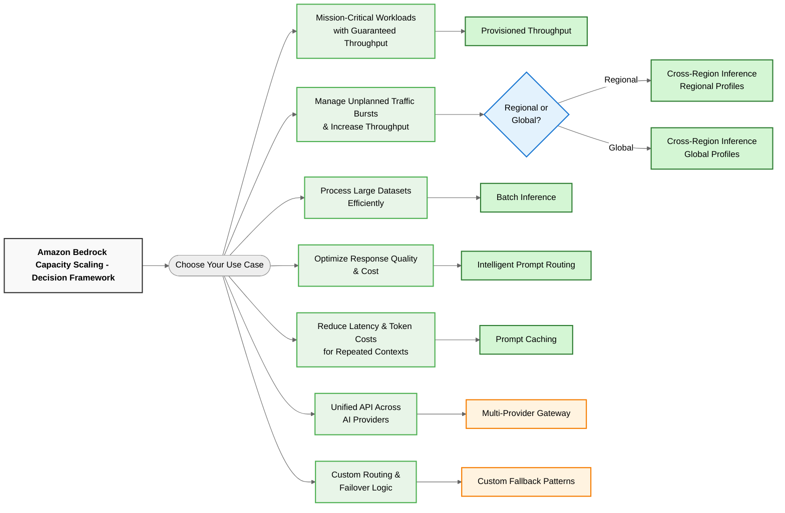

# Amazon Bedrock Capacity Scaling - Decision Framework

```mermaid
%%{init: {'theme':'neutral'}}%%
flowchart LR
    Title[<b>Amazon Bedrock Capacity Scaling - Decision Framework</b>]
    
    Title --> Start([Choose Your Use Case])
    
    Start --> Throughput[Mission-Critical Workloads<br/>with Guaranteed Throughput]
    Start --> Scale[Manage Unplanned Traffic Bursts<br/>& Increase Throughput]
    Start --> Efficiency[Process Large Datasets<br/>Efficiently]
    Start --> Quality[Optimize Response Quality<br/>& Cost]
    Start --> Latency[Reduce Latency & Token Costs<br/>for Repeated Contexts]
    Start --> Providers[Unified API Across<br/>AI Providers]
    Start --> Custom[Custom Routing &<br/>Failover Logic]

    Throughput --> PT[Provisioned Throughput]
    Scale --> Geography{Regional or<br/>Global?}
    Geography -->|Regional| Regional[Cross-Region Inference<br/>Regional Profiles]
    Geography -->|Global| Global[Cross-Region Inference<br/>Global Profiles]
    Efficiency --> Batch[Batch Inference]
    Quality --> Routing[Intelligent Prompt Routing]
    Latency --> Cache[Prompt Caching]
    Providers --> Gateway[Multi-Provider Gateway]
    Custom --> Fallback[Custom Fallback Patterns]

    %% Styling
    classDef aws fill:#d4f6d4,stroke:#2e7d32,stroke-width:2px
    classDef custom fill:#fff3e0,stroke:#f57c00,stroke-width:2px
    classDef usecase fill:#e8f5e8,stroke:#4caf50,stroke-width:2px
    classDef decision fill:#e3f2fd,stroke:#1976d2,stroke-width:2px
    classDef title fill:#f9f9f9,stroke:#333,stroke-width:2px,color:#000

    class PT,Regional,Global,Batch,Routing,Cache aws
    class Gateway,Fallback custom
    class Throughput,Scale,Efficiency,Quality,Latency,Providers,Custom usecase
    class Geography decision
    class Title title
```
