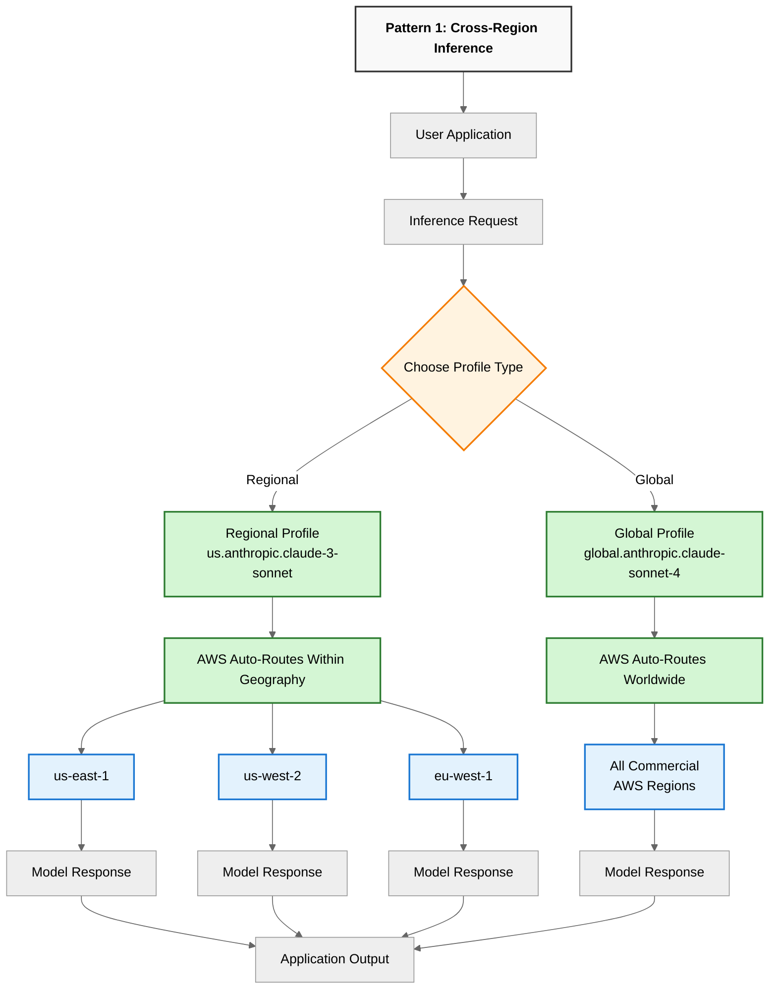

# Pattern 1: Cross-Region Inference

```mermaid
%%{init: {'theme':'neutral'}}%%
flowchart TD
    Title[<b>Pattern 1: Cross-Region Inference</b>]
    
    Title --> User[User Application]
    
    User --> Request[Inference Request]
    Request --> Profile{Choose Profile Type}
    
    Profile -->|Regional| Regional[Regional Profile<br/>us.anthropic.claude-3-sonnet]
    Profile -->|Global| Global[Global Profile<br/>global.anthropic.claude-sonnet-4]
    
    Regional --> RegionalRouting[AWS Auto-Routes Within Geography]
    Global --> GlobalRouting[AWS Auto-Routes Worldwide]
    
    RegionalRouting --> USEast[us-east-1]
    RegionalRouting --> USWest[us-west-2]
    RegionalRouting --> EUWest[eu-west-1]
    
    GlobalRouting --> AllRegions[All Commercial<br/>AWS Regions]
    
    USEast --> Response1[Model Response]
    USWest --> Response2[Model Response]
    EUWest --> Response3[Model Response]
    AllRegions --> Response4[Model Response]
    
    Response1 --> Output[Application Output]
    Response2 --> Output
    Response3 --> Output
    Response4 --> Output
    
    %% Styling
    classDef aws fill:#d4f6d4,stroke:#2e7d32,stroke-width:2px
    classDef region fill:#e3f2fd,stroke:#1976d2,stroke-width:2px
    classDef decision fill:#fff3e0,stroke:#f57c00,stroke-width:2px
    classDef title fill:#f9f9f9,stroke:#333,stroke-width:2px,color:#000
    
    class Regional,Global,RegionalRouting,GlobalRouting aws
    class USEast,USWest,EUWest,AllRegions region
    class Profile decision
    class Title title
```
