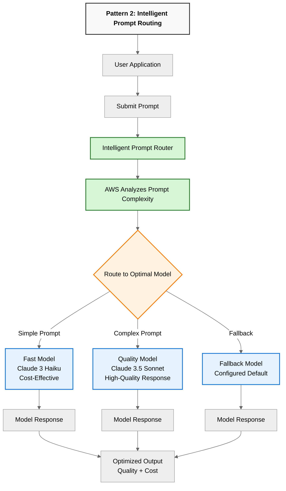

# Pattern 2: Intelligent Prompt Routing

```mermaid
%%{init: {'theme':'neutral'}}%%
flowchart TD
    Title[<b>Pattern 2: Intelligent Prompt Routing</b>]
    
    Title --> User[User Application]
    
    User --> Prompt[Submit Prompt]
    Prompt --> Router[Intelligent Prompt Router]
    
    Router --> Analysis[AWS Analyzes Prompt Complexity]
    Analysis --> Decision{Route to Optimal Model}
    
    Decision -->|Simple Prompt| Fast[Fast Model<br/>Claude 3 Haiku<br/>Cost-Effective]
    Decision -->|Complex Prompt| Quality[Quality Model<br/>Claude 3.5 Sonnet<br/>High-Quality Response]
    Decision -->|Fallback| Fallback[Fallback Model<br/>Configured Default]
    
    Fast --> Response1[Model Response]
    Quality --> Response2[Model Response]
    Fallback --> Response3[Model Response]
    
    Response1 --> Output[Optimized Output<br/>Quality + Cost]
    Response2 --> Output
    Response3 --> Output
    
    %% Styling
    classDef aws fill:#d4f6d4,stroke:#2e7d32,stroke-width:2px
    classDef model fill:#e3f2fd,stroke:#1976d2,stroke-width:2px
    classDef decision fill:#fff3e0,stroke:#f57c00,stroke-width:2px
    classDef title fill:#f9f9f9,stroke:#333,stroke-width:2px,color:#000
    
    class Router,Analysis aws
    class Fast,Quality,Fallback model
    class Decision decision
    class Title title
```
