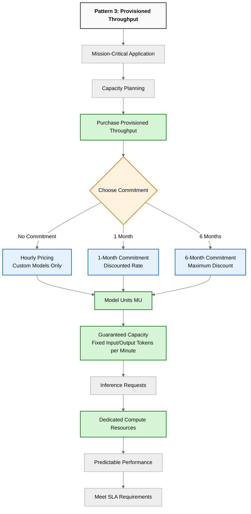

# Pattern 3: Provisioned Throughput

```mermaid
%%{init: {'theme':'neutral'}}%%
flowchart TD
    Title[<b>Pattern 3: Provisioned Throughput</b>]
    
    Title --> Business[Mission-Critical Application]
    
    Business --> Planning[Capacity Planning]
    Planning --> Purchase[Purchase Provisioned Throughput]
    
    Purchase --> Commitment{Choose Commitment}
    Commitment -->|No Commitment| Hourly[Hourly Pricing<br/>Custom Models Only]
    Commitment -->|1 Month| Month1[1-Month Commitment<br/>Discounted Rate]
    Commitment -->|6 Months| Month6[6-Month Commitment<br/>Maximum Discount]
    
    Hourly --> ModelUnits[Model Units MU]
    Month1 --> ModelUnits
    Month6 --> ModelUnits
    
    ModelUnits --> Capacity[Guaranteed Capacity<br/>Fixed Input/Output Tokens per Minute]
    
    Capacity --> Request[Inference Requests]
    Request --> Dedicated[Dedicated Compute Resources]
    Dedicated --> Response[Predictable Performance]
    
    Response --> SLA[Meet SLA Requirements]
    
    %% Styling
    classDef aws fill:#d4f6d4,stroke:#2e7d32,stroke-width:2px
    classDef commitment fill:#e3f2fd,stroke:#1976d2,stroke-width:2px
    classDef decision fill:#fff3e0,stroke:#f57c00,stroke-width:2px
    classDef title fill:#f9f9f9,stroke:#333,stroke-width:2px,color:#000
    
    class Purchase,ModelUnits,Capacity,Dedicated aws
    class Hourly,Month1,Month6 commitment
    class Commitment decision
    class Title title
```
