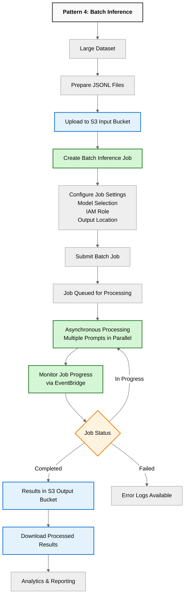

# Pattern 4: Batch Inference

```mermaid
%%{init: {'theme':'neutral'}}%%
flowchart TD
    Title[<b>Pattern 4: Batch Inference</b>]
    
    Title --> Dataset[Large Dataset]
    
    Dataset --> Prepare[Prepare JSONL Files]
    Prepare --> Upload[Upload to S3 Input Bucket]
    
    Upload --> Job[Create Batch Inference Job]
    Job --> Config[Configure Job Settings<br/>Model Selection<br/>IAM Role<br/>Output Location]
    
    Config --> Submit[Submit Batch Job]
    Submit --> Queue[Job Queued for Processing]
    
    Queue --> Process[Asynchronous Processing<br/>Multiple Prompts in Parallel]
    Process --> Monitor[Monitor Job Progress<br/>via EventBridge]
    
    Monitor --> Status{Job Status}
    Status -->|In Progress| Process
    Status -->|Completed| Results[Results in S3 Output Bucket]
    Status -->|Failed| Error[Error Logs Available]
    
    Results --> Download[Download Processed Results]
    Download --> Analytics[Analytics & Reporting]
    
    %% Styling
    classDef aws fill:#d4f6d4,stroke:#2e7d32,stroke-width:2px
    classDef s3 fill:#e3f2fd,stroke:#1976d2,stroke-width:2px
    classDef decision fill:#fff3e0,stroke:#f57c00,stroke-width:2px
    classDef title fill:#f9f9f9,stroke:#333,stroke-width:2px,color:#000
    
    class Job,Process,Monitor aws
    class Upload,Results,Download s3
    class Status decision
    class Title title
```
