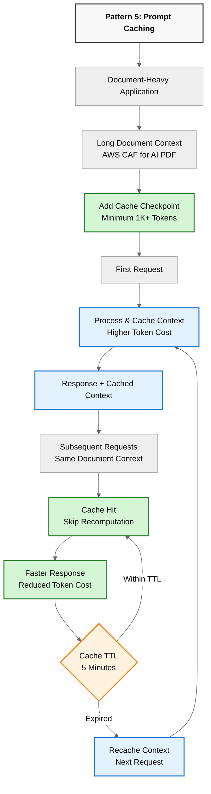

# Pattern 5: Prompt Caching

```mermaid
%%{init: {'theme':'neutral'}}%%
flowchart TD
    Title[<b>Pattern 5: Prompt Caching</b>]
    
    Title --> App[Document-Heavy Application]
    
    App --> Context[Long Document Context<br/>AWS CAF for AI PDF]
    Context --> Cache[Add Cache Checkpoint<br/>Minimum 1K+ Tokens]
    
    Cache --> FirstRequest[First Request]
    FirstRequest --> Process1[Process & Cache Context<br/>Higher Token Cost]
    Process1 --> Response1[Response + Cached Context]
    
    Response1 --> SubsequentRequests[Subsequent Requests<br/>Same Document Context]
    SubsequentRequests --> CacheHit[Cache Hit<br/>Skip Recomputation]
    
    CacheHit --> FastResponse[Faster Response<br/>Reduced Token Cost]
    
    FastResponse --> TTL{Cache TTL<br/>5 Minutes}
    TTL -->|Within TTL| CacheHit
    TTL -->|Expired| Recache[Recache Context<br/>Next Request]
    
    Recache --> Process1
    
    %% Styling
    classDef aws fill:#d4f6d4,stroke:#2e7d32,stroke-width:2px
    classDef cache fill:#e3f2fd,stroke:#1976d2,stroke-width:2px
    classDef decision fill:#fff3e0,stroke:#f57c00,stroke-width:2px
    classDef title fill:#f9f9f9,stroke:#333,stroke-width:2px,color:#000
    
    class Cache,CacheHit,FastResponse aws
    class Process1,Response1,Recache cache
    class TTL decision
    class Title title
```
