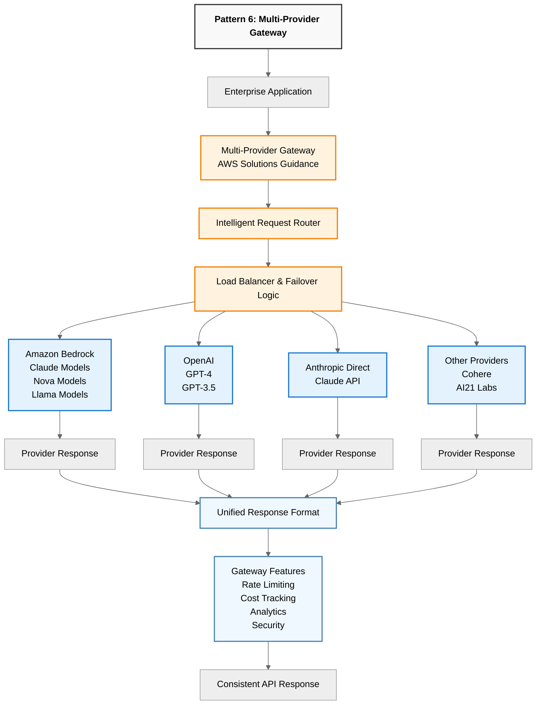

# Pattern 6: Multi-Provider Gateway

## AWS Solutions Guidance Architecture

*Source: [AWS Solutions Guidance for Multi-Provider Generative AI Gateway](https://github.com/aws-solutions-library-samples/guidance-for-multi-provider-generative-ai-gateway-on-aws)*

## Pattern Overview Diagram

