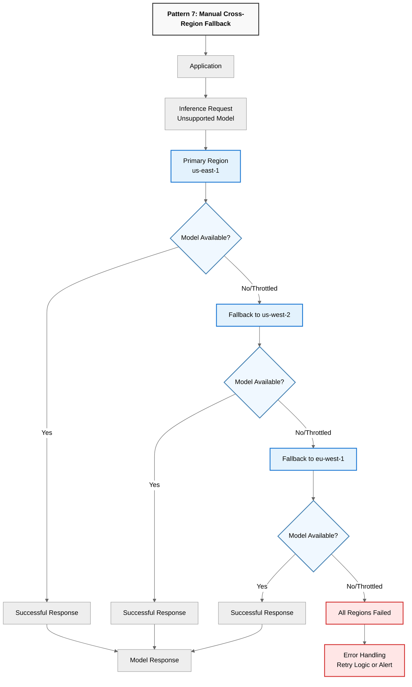

# Pattern 7: Manual Cross-Region Fallback

```mermaid
%%{init: {'theme':'neutral'}}%%
flowchart TD
    Title[<b>Pattern 7: Manual Cross-Region Fallback</b>]
    
    Title --> App[Application]
    
    App --> Request[Inference Request<br/>Unsupported Model]
    Request --> Primary[Primary Region<br/>us-east-1]
    
    Primary --> Check1{Model Available?}
    Check1 -->|Yes| Success1[Successful Response]
    Check1 -->|No/Throttled| Fallback1[Fallback to us-west-2]
    
    Fallback1 --> Check2{Model Available?}
    Check2 -->|Yes| Success2[Successful Response]
    Check2 -->|No/Throttled| Fallback2[Fallback to eu-west-1]
    
    Fallback2 --> Check3{Model Available?}
    Check3 -->|Yes| Success3[Successful Response]
    Check3 -->|No/Throttled| AllFailed[All Regions Failed]
    
    Success1 --> Response[Model Response]
    Success2 --> Response
    Success3 --> Response
    AllFailed --> Error[Error Handling<br/>Retry Logic or Alert]
    
    %% Styling
    classDef custom fill:#fff3e0,stroke:#f57c00,stroke-width:2px
    classDef region fill:#e3f2fd,stroke:#1976d2,stroke-width:2px
    classDef decision fill:#f0f8ff,stroke:#4682b4,stroke-width:2px
    classDef error fill:#ffe6e6,stroke:#d32f2f,stroke-width:2px
    classDef title fill:#f9f9f9,stroke:#333,stroke-width:2px,color:#000
    
    class Primary,Fallback1,Fallback2 region
    class Check1,Check2,Check3 decision
    class AllFailed,Error error
    class Title title
```
