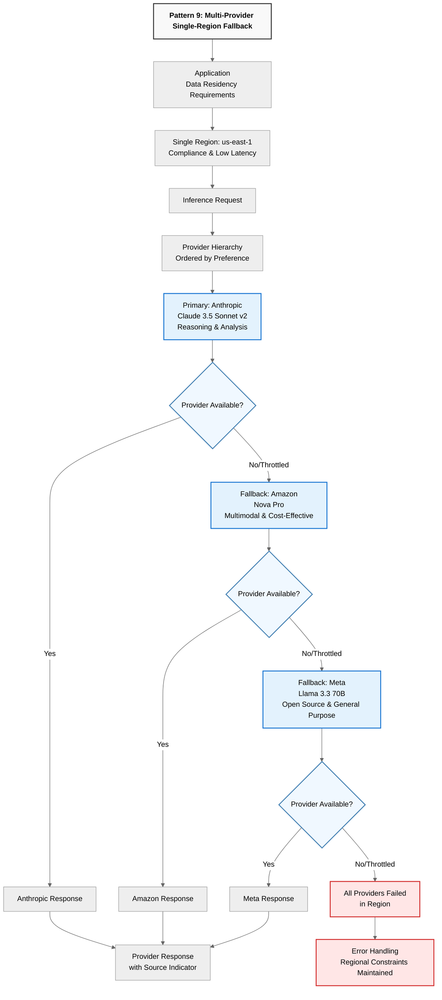

# Pattern 9: Multi-Provider Single-Region Fallback

```mermaid
%%{init: {'theme':'neutral'}}%%
flowchart TD
    Title[<b>Pattern 9: Multi-Provider Single-Region Fallback</b>]
    
    Title --> App[Application<br/>Data Residency Requirements]
    
    App --> Region[Single Region: us-east-1<br/>Compliance & Low Latency]
    
    Region --> Request[Inference Request]
    Request --> Hierarchy[Provider Hierarchy<br/>Ordered by Preference]
    
    Hierarchy --> Provider1[Primary: Anthropic<br/>Claude 3.5 Sonnet v2<br/>Reasoning & Analysis]
    
    Provider1 --> Check1{Provider Available?}
    Check1 -->|Yes| Success1[Anthropic Response]
    Check1 -->|No/Throttled| Provider2[Fallback: Amazon<br/>Nova Pro<br/>Multimodal & Cost-Effective]
    
    Provider2 --> Check2{Provider Available?}
    Check2 -->|Yes| Success2[Amazon Response]
    Check2 -->|No/Throttled| Provider3[Fallback: Meta<br/>Llama 3.3 70B<br/>Open Source & General Purpose]
    
    Provider3 --> Check3{Provider Available?}
    Check3 -->|Yes| Success3[Meta Response]
    Check3 -->|No/Throttled| AllFailed[All Providers Failed<br/>in Region]
    
    Success1 --> Response[Provider Response<br/>with Source Indicator]
    Success2 --> Response
    Success3 --> Response
    AllFailed --> Error[Error Handling<br/>Regional Constraints Maintained]
    
    %% Styling
    classDef custom fill:#fff3e0,stroke:#f57c00,stroke-width:2px
    classDef provider fill:#e3f2fd,stroke:#1976d2,stroke-width:2px
    classDef decision fill:#f0f8ff,stroke:#4682b4,stroke-width:2px
    classDef error fill:#ffe6e6,stroke:#d32f2f,stroke-width:2px
    classDef title fill:#f9f9f9,stroke:#333,stroke-width:2px,color:#000
    
    class Provider1,Provider2,Provider3 provider
    class Check1,Check2,Check3 decision
    class AllFailed,Error error
    class Title title
```
